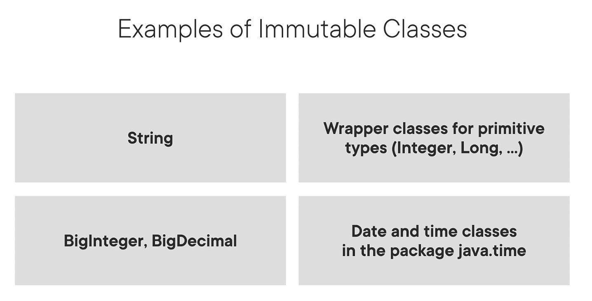

# Utilizing Java Object-Oriented Approach

## Declare and instantiate Java objects including nested class objects, and explain the object life-cycle including creation, reassigning references, and garbage collection

blah blah blah

## Create classes and records, and define and use instance and static fields and methods, constructors, and instance and static initializers

Example of an
 [Immutable Class](records/Product.java), i.e., the old way 
Example of a  [Record Class](records/ProductRecord.java), i.e., the new way. Note the comments regarding what the compiler generates.

### Class Hierarchy of Records

- Records are implicitly `final`
- Records cannot extend classes, but can implement interfaces
- The common superclass for records is `java.lang.Record`

### Practical use for Records

- Domain Objects
- Value Objects (Examples: String, Integer, Long, BigInteger, BigDecimal, java.time).
    - A value object does not have an identity
- Data Transfer Objects

#### Non-Use cases for Records

- Records CANNOT be used for JPA entities as JPA entity classes are required to be mutable, i.e., entities must not be `final`, must include a no-argument constructor, and the persistance fields cannot be `final`.  
- Records are not a direct replacement for JavaBeans - does not use the 'setter' and 'getter' naming convention. Also, not all JavaBeans are immutable.
- Singleton - The canonical constructor cannot be made `private`

## Implement overloading, including var-arg methods

blah blah blah

## Understand variable scopes, use local variable type inference, apply encapsulation, and make objects immutable

### Immutable Objects

#### Examples

#### Advantages

1. Programs are less complicated
1. Thread-safe
1. Collections such as HashMap and HashSet expect immutability
1. Objects can be safely shared and reused

## Implement polymorphism and differentiate object type versus reference type. Perform type casting, identify object types using instanceof operator and pattern matching

blah blah blah

## Create and use interfaces, identify functional interfaces, and utilize private, static, and default interface methods

blah blah blah

## Create and use enumerations with fields, methods and constructors

blah blah blah